# 1. Compute Engine による VM のセットアップと REST API の構築

## Google Cloud Skills Boost - Compute Engine を使用した Google Cloud でのウェブアプリのホスティング

### Chromeのインストールとログイン

1. Google Cloud Skills Boost の受講には Chrome を使用することが推奨されています。
[こちら](https://www.google.com/intl/ja_ALL/chrome/)
からダウンロードし、インストールしてください。
1. Chromeを起動し、右上のアイコンをクリックします。

    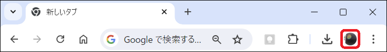

1. `追加`をクリックし、事前に配布しているドメインが`@gdsc.tamasan238.work`のアカウントでログインしてください。
1. [Google Cloud Skills Boost](https://www.cloudskillsboost.google/?locale=ja)
にアクセスし、右上の`ログイン`をクリックします。

    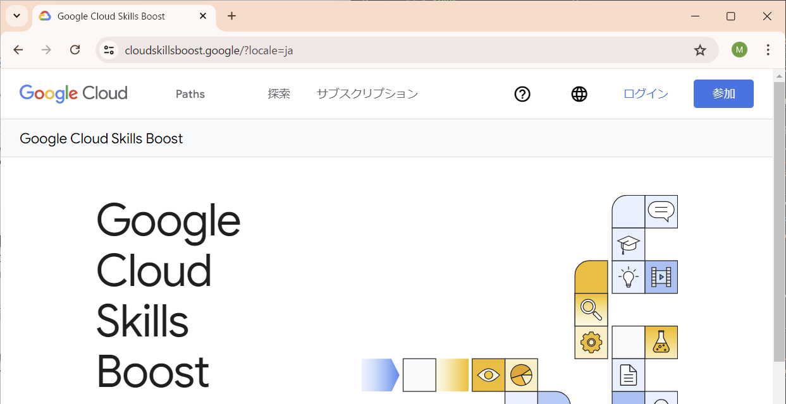

1. 続いて`Google アカウントでログイン`をクリックすると、Google Cloud Skills Boostにログインすることができました。

    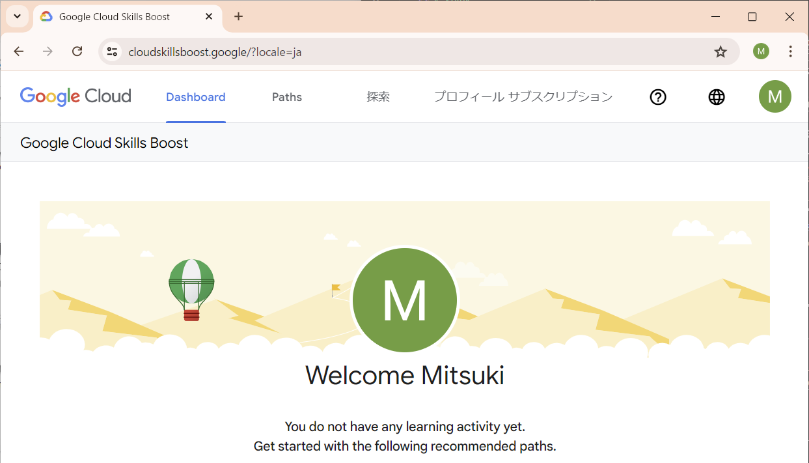

### Google Cloudにアクセスする
Google Cloud Skills Boostの受講にあたって、以下の注意事項を確認してください。

- ラボを受講するにはCreditが必要です。初回はNo Costのラボでも2回目以降にCreditが必要になることがあります。
- ラボには制限時間が設けられています。制限時間内に終了できるようにしましょう。

それでは、ラボを開始しましょう。

1. [Compute Engine を使用した Google Cloud でのウェブアプリのホスティング](https://www.cloudskillsboost.google/course_templates/638/labs/480366?locale=ja)
にアクセスします。

> [!CAUTION]
> No Costと表示されていることを確認してください。
>
> 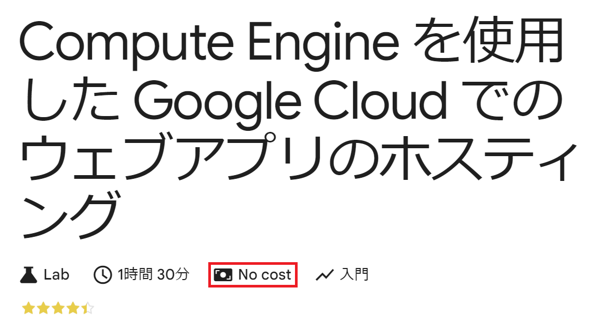

2. `ラボを開始`をクリックします。

    ラボを開始すると、ラボの終了まで使用できる一時的なGoogleアカウントが発行されます。

    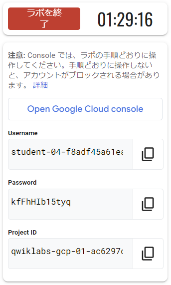

3. `Open Google Cloud console`を**右クリック**し、`シークレット ウィンドウで開く`を選択します。
    1. ログイン画面が表示されたら、先ほど発行された**Username**をコピー&ペーストして`次へ`をクリックします。

        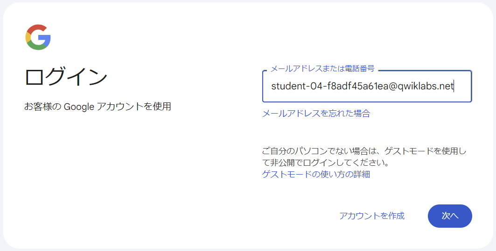
    
    2. 同様に**Password**をコピー&ペーストして`次へ`をクリックします。
    
        

4. 確認画面が表示されます。内容を確認して`理解しました`をクリックします。

    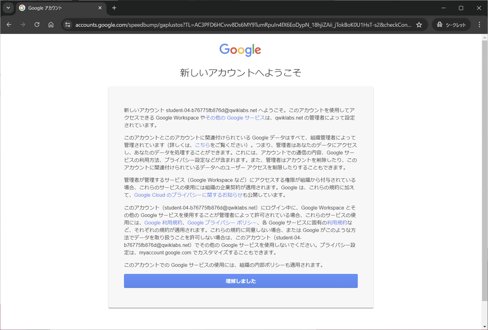

5. 同意画面が表示されます。内容を確認して1つ目のチェックボックスにチェックをつけて`AGREE AND CONTINUE`をクリックします。

    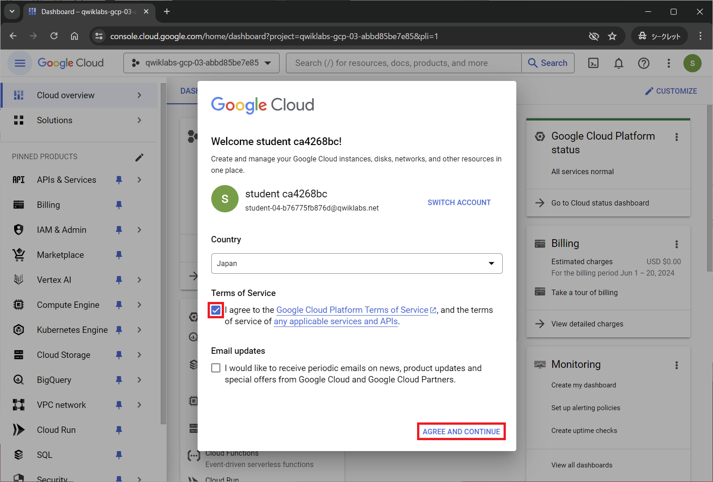

6. Google Cloud コンソールのダッシュボードにアクセスすることができました。

    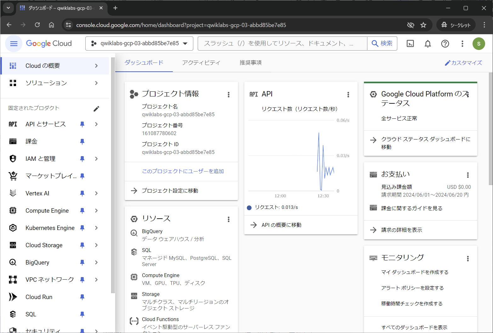

> [!TIP]
> 言語は右上の三点メニューの`Perferences`または`設定`から変更することができます。
> 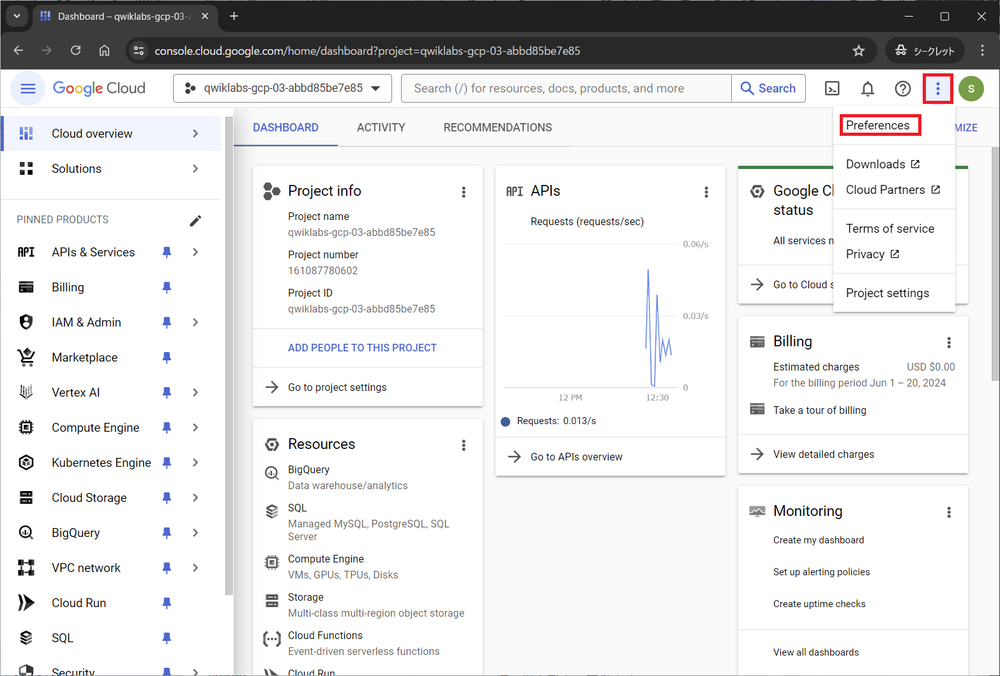

### Cloud Shell をアクティブにする
Cloud Shellは、開発ツールと一緒に読み込まれるGoogle Cloudで稼働する仮想マシンです。Cloud Shellを使用すると、コマンドラインでGoogle Cloudリソースにアクセスできます。

1. コンソール画面上部にある`Cloud Shell をアクティブにする`アイコンをクリックします。
2. 画面下部にCloud Shellが現れ、ポップアップが表示されるので`承認`をクリックします。

    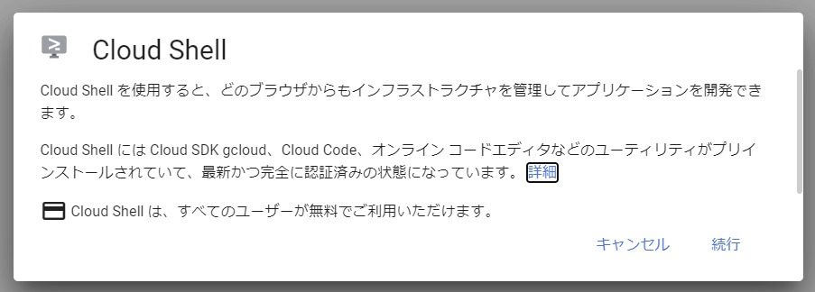

    接続が完了した時点で、プロジェクトに各自の`PROJECT_ID`が設定されます。黄色の文字列で出力されているのが`PROJECT_ID`です。

    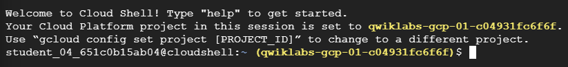
    
    `PROJECT_ID`は後ほど使用しますので、メモ帳などに保存しておいてください。

### Cloud Shellを使用してみる
次のコマンドを使用すると、有効なアカウント名を一覧で表示します。
```sh
gcloud auth list
```

ポップアップが表示されるので`承認`をクリックします。

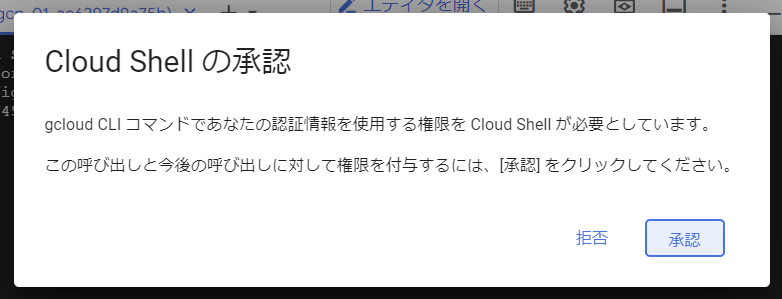

次のコマンドを使用すると、プロジェクトIDを一覧で表示します。
```sh
gcloud config list project
```

`gcloud`はGoogle Cloudのコマンドラインツールです。このツールはCloud Shellにプリインストールされています。

## Compute Engine での Go のスタートガイド

### 目標
- Cloud Shellを使用してHello Worldサンプルアプリをダウンロードしてデプロイする。
- Cloud Buildを使用してHello Worldサンプルアプリをビルドする。
- Hello Worldサンプルアプリを単一のCompute Engineインスタンスにデプロイする。
- 以上の工程を踏まえて、仮想マシン上で自作アプリを動作させる。

### 料金
今回はSkills Boostアカウントを通じてGoogle Cloud Platformを使用しているので、読み飛ばして構いません。

### 準備
1. Compute Engine APIとCloud Build APIを有効にします。

    1. [こちら](https://console.cloud.google.com/flows/enableapi?apiid=compute%2Ccloudbuild.googleapis.com&hl=ja&_ga=2.43494823.320691267.1718768559-758716497.1715673126)
    のリンクを**右クリック**し、シークレットウィンドウで開きます。
    2. プロジェクト名が先ほどメモした`PROJECT_ID`と同じであることを確認して`次へ`をクリックします。

        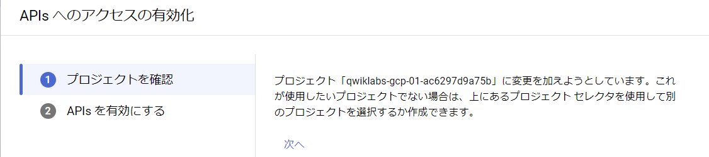

    3. `有効にする`をクリックします。

        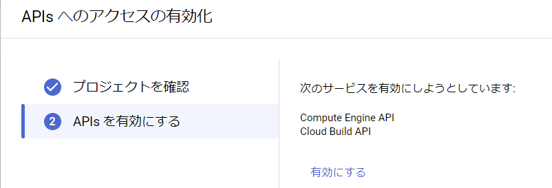

2. 環境のセットアップ（git clone）を行います。Cloud Shellでは直接クラウドリソースにアクセスすることができます。
    1. [こちら](https://cloud.google.com/console/cloudshell/open?git_repo=https%3A%2F%2Fgithub.com%2FGoogleCloudPlatform%2Fgolang-samples&working_dir=getting-started%2Fgce&hl=ja)
    のリンクを**右クリック**し、シークレットウィンドウで開きます。
    2. `確認`をクリックします。

        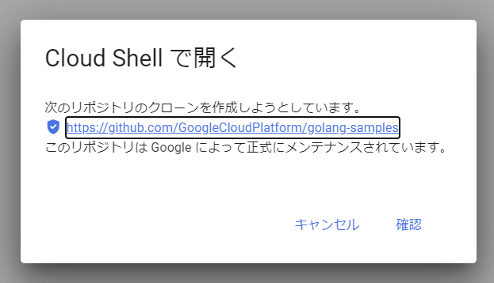

3. 次のコマンドをCloud Shellで実行し、新しいGoogle Cloudプロジェクトを設定します。
    ```sh
    gcloud config set project PROJECT_ID
    ```
> [!IMPORTANT]
> `PROJECT_ID`をそれぞれのIDに置き換えてください。

### Cloud Shellでアプリを実行
1. 次のコマンドをCloud Shellで実行し、Cloud Shellでローカルウェブサーバーを起動します。
    ```sh
    go build -o app
    ./app
    ```

2. Cloud Shell画面右上の`ウェブでプレビュー`アイコンをクリックし、`ポート8080でプレビュー`を選択します。新しいウィンドウが開き、実行中のアプリが表示されます。

    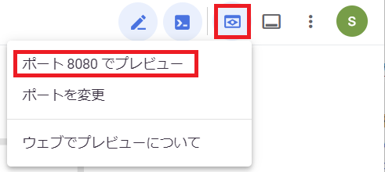

3. ウェブブラウザに「`Hello, World!`」と表示されます。

    

4. Cloud Shellの画面に戻り、`Ctrl`+`C`キーを同時に押してローカルウェブサーバを停止させます。

    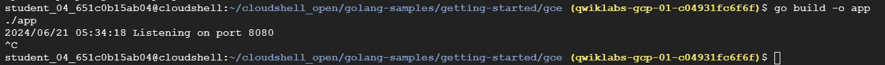

### ファイルの修正
次にCloud Buildを使用し、アプリのビルドを行います。提供されているファイルには不具合があるため、ビルドを行う前にファイルの修正を行います。

1. Logging機能が動作しないため、`startup-script.sh`ファイルを編集します。
    1. Cloud Shell Editorの画面でEXPLORERを開きます。
    2. `cloudshell_open/golang-samples/getting-started/gce/startup-script.sh`にアクセスします。

        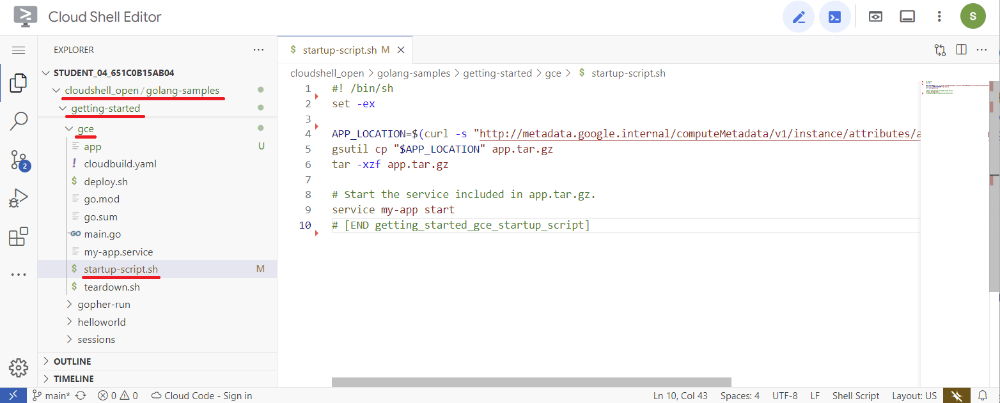
    
    3. `Ctrl`+`A`キーを同時に押してテキストを全選択し、`Delete`キーで全削除します。
    4. [こちら](./source/1/startup-script.sh)
        にアクセスし、コードをコピーして先ほど内容を全削除した`startup-script.sh`に貼り付けます。
    5. 変更内容は自動的に保存されます。

2. ビルド環境と実行環境のバージョンを合わせるため、`cloudbuild.yaml`ファイルを編集します。
    1. 先ほどと同様にCloud Shell Editorの画面でEXPLORERを開きます。
    2. `cloudshell_open/golang-samples/getting-started/gce/cloudbuild.yaml`にアクセスします。

        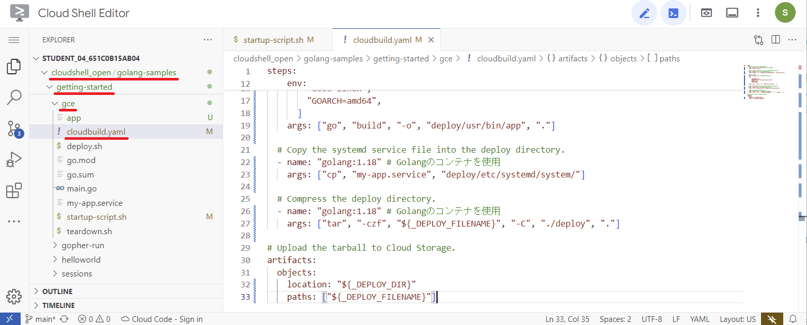

    3. `Ctrl`+`A`キーを同時に押してテキストを全選択し、`Delete`キーで全削除します。
    4. [こちら](./source/1/cloudbuild.yaml)
        にアクセスし、コードをコピーして先ほど内容を全削除した`cloudbuild.yaml`に貼り付けます。
    5. 変更内容は自動的に保存されます。

### アプリのビルド
Cloud Buildを使用すると、アプリをビルドしてtarファイルに圧縮し、Cloud Storageバケットにこのファイルをアップロードできます。バケットは、Cloud Storageでデータを格納する基本的なコンテナです。

1. Cloud Shellで次のコマンドを実行し、Cloud Storageバケットを作成します。`YOUR_BUCKET_NAME` はバケット名を表します。
    ```sh
    gsutil mb gs://YOUR_BUCKET_NAME
    ```

> [!IMPORTANT]
> `YOUR_BUCKET_NAME`をそれぞれのバケット名に置き換えてください。
> - バケットには任意の名前を付けることができます。付けられるバケット名には[条件](https://cloud.google.com/storage/docs/buckets?hl=ja#naming)があります。
> - 今回は`PROJECT_ID`をバケット名として使用します。

2. 次のコマンドを実行してビルドを開始します。
    ```sh
    gcloud builds submit --substitutions=_DEPLOY_DIR=gs://YOUR_BUCKET_NAME,_DEPLOY_FILENAME=app.tar.gz
    ```

> [!IMPORTANT]
> `YOUR_BUCKET_NAME`をそれぞれのバケット名に置き換えてください。

### Compute Engine インスタンスの作成と構成
1. 次のコマンドを実行してCompute Engineインスタンスを作成します。`zone`は目的などに応じて[任意](https://cloud.google.com/docs/geography-and-regions?hl=ja)に指定することができます。今回は`us-central1-a`を使用します。
    ```sh
    gcloud compute instances create my-app-instance \
    --image-family=debian-10 \
    --image-project=debian-cloud \
    --machine-type=g1-small \
    --scopes userinfo-email,cloud-platform \
    --metadata-from-file startup-script=startup-script.sh \
    --metadata app-location="gs://YOUR_BUCKET_NAME/app.tar.gz" \
    --zone us-central1-a \
    --tags http-server
    ```

> [!IMPORTANT]
> `YOUR_BUCKET_NAME`をそれぞれのバケット名に置き換えてください。

2. 次のコマンドを実行してインスタンスへのトラフィックを許可するファイアウォールルールを作成します。
    ```sh
    gcloud compute firewall-rules create default-allow-http-80 \
    --allow tcp:80 \
    --source-ranges 0.0.0.0/0 \
    --target-tags http-server \
    --description "Allow port 80 access to http-server"
    ```

3. 次のコマンドを実行してインスタンスの外部IPアドレスを取得します。
    ```sh
    gcloud compute instances list
    ```
    インターナルの外部IPアドレスは`EXTERNAL_IP: xxx.xxx.xxx.xxx`の形式で出力されます。

    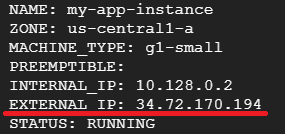

4. ブラウザで次のURLにアクセスし、アプリが実行されていることを確認してください。
    ```
    http://YOUR_INSTANCE_IP
    ```
> [!IMPORTANT]
> `YOUR_INSTANCE_IP`をそれぞれ確認した外部IPアドレスに置き換えてください。

5. 「`Hello, World!`」と表示されていれば成功です。

    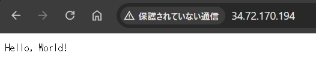

    仮想マシン上でアプリが動作していることを確認できました。

### リソースを削除
アプリの動作が確認できたので、次の手順に備えてリソースを削除します。
1. インスタンスの削除
    1. 次のコマンドを実行して、インスタンスを削除します。
        ```sh
        gcloud compute instances delete my-app-instance --zone=us-central1-a --delete-disks=all
        ```
        > [!IMPORTANT]
        > 削除するインスタンスの`zone`を指定する必要があります。今回は`us-central1-a`です。

    2.  削除の際に確認が求められるので`y`を入力し`Enter`キーで確定します。

        

2. ファイアウォールルールの削除

    1. 次のコマンドを実行して、ファイアウォールルールを削除します。
        ```sh
        gcloud compute firewall-rules delete default-allow-http-80
        ```
    2.  削除の際に確認が求められるので`y`を入力し`Enter`キーで確定します。


### 自作アプリを仮想マシン上で動作させる
`main.go`のプログラムを書き換えて、顧客のデータが確認できるようなアプリを仮想マシン上で実現してみましょう。

1. `main.go`ファイルを書き換えます。
    1. Cloud Shell Editorの画面でEXPLORERを開きます。
    2. `cloudshell_open/golang-samples/getting-started/gce/main.go`にアクセスします。
        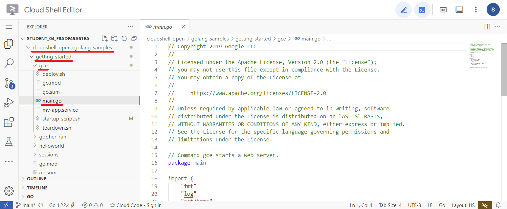
    3. `Ctrl`+`A`キーを同時に押してテキストを全選択し、`Delete`キーで全削除します。
    4. [こちら](./source/1/main.go)
        にアクセスし、コードをコピーして先ほど内容を全削除した`main.go`に貼り付けます。
    5. 変更内容は自動的に保存されます。

2. Cloud Shellで以下のコマンドを実行し、アプリのビルドに必要なライブラリをインストールします。
    ```sh
    go get github.com/gorilla/handlers
    go get github.com/gorilla/mux
    ```

3. 先ほどと同様の手順で、ビルドを行います。
    ```sh
    gcloud builds submit --substitutions=_DEPLOY_DIR=gs://YOUR_BUCKET_NAME,_DEPLOY_FILENAME=app.tar.gz
    ```

> [!IMPORTANT]
> `YOUR_BUCKET_NAME`をそれぞれのバケット名に置き換えてください。

4. 同様に、Compute Engineインスタンスを作成します。
    ```sh
    gcloud compute instances create my-app-instance \
    --image-family=debian-10 \
    --image-project=debian-cloud \
    --machine-type=g1-small \
    --scopes userinfo-email,cloud-platform \
    --metadata-from-file startup-script=startup-script.sh \
    --metadata app-location="gs://YOUR_BUCKET_NAME/app.tar.gz" \
    --zone us-central1-a \
    --tags http-server
    ```

> [!IMPORTANT]
> `YOUR_BUCKET_NAME`をそれぞれのバケット名に置き換えてください。

5. 同様に、ファイアウォールルールを作成します。
    ```sh
    gcloud compute firewall-rules create default-allow-http-80 \
    --allow tcp:80 \
    --source-ranges 0.0.0.0/0 \
    --target-tags http-server \
    --description "Allow port 80 access to http-server"
    ```

6. 以下のコマンドを実行して、インスタンスの外部IPアドレスを取得します。
    ```sh
    gcloud compute instances list
    ```
    インターナルの外部IPアドレスは`EXTERNAL_IP: xxx.xxx.xxx.xxx`の形式で出力されます。
    
    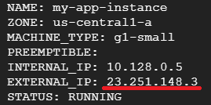

7. ブラウザで次のURLにアクセスし、アプリが実行されていることを確認してください。
    ```
    http://YOUR_INSTANCE_IP/v1/customer/22530
    ```
> [!IMPORTANT]
> `YOUR_INSTANCE_IP`をそれぞれ確認した外部IPアドレスに置き換えてください。

8. 外部IPアドレスにアクセスし、「`{"status": "success", "data": {"approved":585,"proposed":1602,"rejected":489}}`」と表示されていれば成功です。

    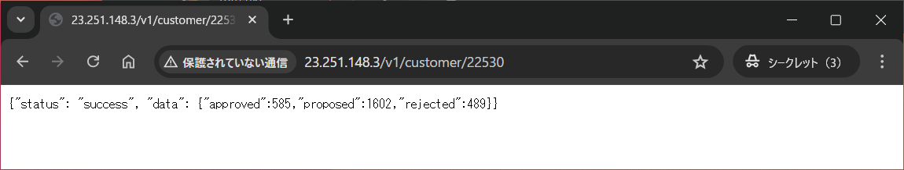

    1. ここでURL末尾の`22530`は
    [main.go](./source/1/main.go)
    で定義している顧客の`ID`に対応しています。URLを指定することで顧客の取引履歴にアクセスしています。
    2. 以下は取引履歴が存在しない`ID: "70156"`の顧客のデータを参照した場合です。

        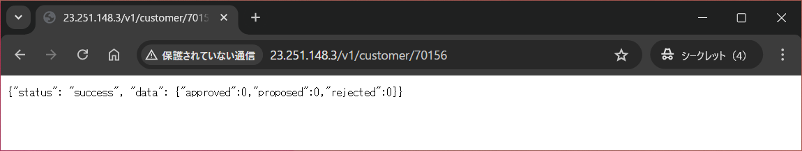
    
    3. 存在しない顧客である`ID: "12345"`を参照するとこのようになります。
    
        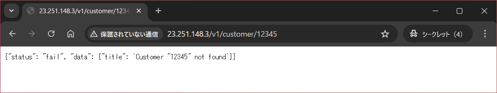
 
## DBの導入やスケーラビリティの実現について

Google Cloud Compute Engine によって、VM のセットアップと REST API の構築が完了しました。

しかし、現状のmain.goはコード内に直接データを記述しているため、アルゴリズムとデータが密結合している状態です。また、データベースを導入していないため、データの永続化やアクセスの管理が難しい状況です。

これを解決するためには、データベースを導入し、データとアルゴリズムを分離することが重要です。

また、スケーラビリティの観点からも、現状の Compute Engine では、負荷が増加した際にスケールアウトが難しいという課題があります。

これらの課題を解決するために、次のステップとして、Cloud Run と Firestore によるサーバーレス REST API の構築を行いましょう。

[2. Cloud Run と Firestore によるサーバーレスREST APIの構築](2-sv-less.md)へ進む

[目次に戻る](README.md)
