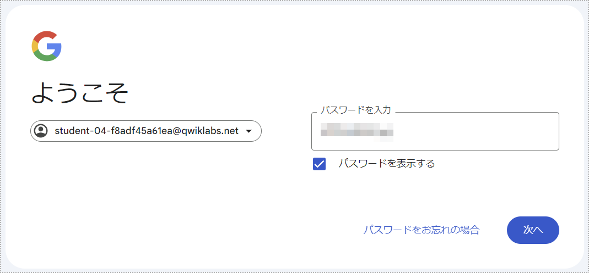

# 1. 仮想マシン(VM)ベースアーキテクチャによるREST API実行環境の構築

前半パートは，以下の流れで進行します．

1. Google Skills Boostを用いたGoogle Cloud環境のセットアップ
1. サンプルプログラムの実行
1. より実践的なプログラムの実行
1. Next to do...

## Google Skills Boostを用いたGoogle Cloud環境のセットアップ

まずは，Google Cloud環境を準備します．  
今回はGoogle Cloud Skills Boostというオンラインラーニングシステムを利用して進行します．

### ChromeのインストールとSkills Boostへのログイン

1. Google Cloud Skills Boost の受講には Chrome を使用することが推奨されています．  
[こちら](https://www.google.com/intl/ja_ALL/chrome/)
からダウンロードし，インストールしてください．

1. Chromeで[Google Cloud Skills Boost](https://www.cloudskillsboost.google/?locale=ja)
にアクセスし，右上の`ログイン`をクリックします．

    

1. 続いて`Google アカウントでログイン`をクリックすると，Google Cloud Skills Boostにログインすることができました．

    

### Skills Boost ラボの開始
Google Cloud Skills Boostの利用にあたって，いくつか注意が必要な箇所があります．

- Creditを求められる(＝有料の)ラボもあります．(今回は無料のラボを使用します．)
- 初回はNo Costのラボでも，2回目以降にはCreditが必要になります．
- ラボには制限時間が設けられています．制限時間内に終了できるようにしましょう．

それでは，ラボを開始しましょう．  
今回は以下のコースをベースとしつつ，いくつかの細かな変更点を加えました．  
Skills Boostの画面にもガイドがありますが，そちらではなく本資料を見ながら進行してくださいね．

1. [Compute Engine を使用した Google Cloud でのウェブアプリのホスティング](https://www.cloudskillsboost.google/course_templates/638/labs/480366?locale=ja)
にアクセスします．

> [!CAUTION]
> No Costと表示されていることを確認してください．
>
> 

2. `ラボを開始`をクリックします．

    ラボを開始すると，ラボの終了まで使用できる一時的なGoogleアカウントが発行されます．  
    以後ログインを求められた場合は，すべてこのGoogleアカウントでログインしてください．  
    個人のGoogleアカウントでログインしてしまうと，意図せず課金されてしまうことがあります．

    

3. `Open Google Cloud console`を**右クリック**し，`シークレット ウィンドウで開く`を選択します．

> [!NOTE]
> 普段使用しているGoogleアカウントへの意図しない課金が発生することを防ぐために，  
> シークレットウィンドウの利用が推奨されています．

4. ログイン画面が表示されたら，先ほど発行された**Username**をコピー&ペーストして`次へ`をクリックします．

    

5. 同様に**Password**をコピー&ペーストして`次へ`をクリックします．

    

6. 確認画面が表示されます．内容を確認して`理解しました`をクリックします．

    

7. 利用規約が表示されます．内容を確認して1つ目のチェックボックスにチェックをつけて`AGREE AND CONTINUE`をクリックします．

    

8. Google Cloud コンソールのダッシュボードにアクセスすることができました．

    

> [!TIP]
> 言語は右上の三点メニューの`Preferences`または`設定`から変更することができます．
> 

### Cloud Shell の有効化

Google Cloud Platformの各機能は，今見えているWeb上のコンソール画面(GUI)とCloud Shellを用いたCUIの両方で扱うことができます．  
今日は，適宜コンソールでのGUI操作とCloud ShellによるCUI操作を使い分けながら進行します．

1. コンソール画面上部にある`Cloud Shell をアクティブにする`アイコンをクリックします．
2. 画面下部にCloud Shellが現れ，ポップアップが表示されるので`続行`をクリックします．

    

    接続が完了した時点で，プロジェクトに各自の`PROJECT_ID`が設定されます．黄色の文字列で出力されているのが`PROJECT_ID`です．

    
    
    `PROJECT_ID`は後ほど使用しますので，メモ帳などに保存しておいてください．

### Cloud Shell の使用
次のコマンドを使用すると，有効なアカウント名を一覧で表示します．
```sh
gcloud auth list
```

ポップアップが表示されるので`承認`をクリックします．


次のコマンドを使用すると，プロジェクトIDを一覧で表示します．
```sh
gcloud config list project
```

`gcloud`はGoogle Cloudのコマンドラインツールです．

## サンプルプログラムの実行

ここからは，VM上で動作させるアプリケーションを作成します．  
ベースとなるプログラムファイルを提供しますので，指示のとおりに改変していきましょう．  

なお，本コースはGoogle Cloudが提供する [Compute Engine での Go のスタートガイド](https://cloud.google.com/go/getting-started/getting-started-on-compute-engine?hl=ja) をベースに作成しています．

### 準備
1. これから扱うCompute Engine APIとCloud Build APIを有効化します．

    1. [こちら](https://console.cloud.google.com/flows/enableapi?apiid=compute%2Ccloudbuild.googleapis.com&hl=ja&_ga=2.43494823.320691267.1718768559-758716497.1715673126)
    のリンクを**右クリック**し，シークレットウィンドウで開きます．
    2. プロジェクト名が先ほどメモした`PROJECT_ID`と同じであることを確認して`次へ`をクリックします．

        

    3. `有効にする`をクリックします．

        

2. Gitリポジトリで提供されるサンプルファイルを取得します．
    1. [こちら](https://cloud.google.com/console/cloudshell/open?git_repo=https%3A%2F%2Fgithub.com%2FGoogleCloudPlatform%2Fgolang-samples&working_dir=getting-started%2Fgce&hl=ja)
    のリンクを**右クリック**し，シークレットウィンドウで開きます．
    2. `確認`をクリックします．

        

3. 次のコマンドをCloud Shellで実行し，新しいGoogle Cloudプロジェクトを設定します．
    ```sh
    gcloud config set project PROJECT_ID
    ```
> [!IMPORTANT]
> `PROJECT_ID`は，ご自身のPROJECT_IDに置き換えてください．

4. 提供されているファイルには不具合があるため，これを修正します．  
まずはLogging機能をバイパスするため，`startup-script.sh`ファイルを編集します．
    1. Cloud Shell Editorの画面でEXPLORERを開きます．
    2. `cloudshell_open/golang-samples/getting-started/gce/startup-script.sh`にアクセスします．

        
    
    3. `Ctrl`+`A`キーを同時に押してテキストを全選択し，`Delete`キーで全削除します．
    4. [こちら](./source/1/startup-script.sh)
        にアクセスし，コードをコピーして先ほど内容を全削除した`startup-script.sh`に貼り付けます．
    5. 変更内容は自動的に保存されます．

5. 続いてビルド環境と実行環境のバージョンを合わせるため，`cloudbuild.yaml`ファイルを編集します．
    1. 先ほどと同様にCloud Shell Editorの画面でEXPLORERを開きます．
    2. `cloudshell_open/golang-samples/getting-started/gce/cloudbuild.yaml`にアクセスします．

        

    3. `Ctrl`+`A`キーを同時に押してテキストを全選択し，`Delete`キーで全削除します．
    4. [こちら](./source/1/cloudbuild.yaml)
        にアクセスし，コードをコピーして先ほど内容を全削除した`cloudbuild.yaml`に貼り付けます．
    5. 変更内容は自動的に保存されます．

ここまでで，サンプルプログラムをビルドするための準備が完了しました．

### ビルド

アプリケーションを動作させるために，Cloud Buildを用いてビルド(≒コンパイル)を行います．

1. Cloud Shellで次のコマンドを実行し，Cloud Buildの動作に必要なCloud Storageバケットを作成します．  
`YOUR_BUCKET_NAME` はバケット名を表します．
    ```sh
    gsutil mb gs://YOUR_BUCKET_NAME
    ```

> [!IMPORTANT]
> `YOUR_BUCKET_NAME`は，ご自身で好きなバケット名をつけて置き換えてください．
> - なお，バケット名には[条件](https://cloud.google.com/storage/docs/buckets?hl=ja#naming)があります．

2. 次のコマンドを実行してビルドを開始します．
    ```sh
    gcloud builds submit --substitutions=_DEPLOY_DIR=gs://YOUR_BUCKET_NAME,_DEPLOY_FILENAME=app.tar.gz
    ```

> [!IMPORTANT]
> `YOUR_BUCKET_NAME`はご自身が定めたバケット名に置き換えてください．

### VMの作成

ここでは，サンプルプログラムのバイナリデータ(ビルド結果)を専用のVMにインストールしてその動作を確認します．

1. まずは次のコマンドを実行してVMを作成します．  
`zone`は目的などに応じて[任意](https://cloud.google.com/docs/geography-and-regions?hl=ja)に指定することができます．今回は`us-central1-a`を使用します．
    ```sh
    gcloud compute instances create my-app-instance \
    --image-family=debian-10 \
    --image-project=debian-cloud \
    --machine-type=g1-small \
    --scopes userinfo-email,cloud-platform \
    --metadata-from-file startup-script=startup-script.sh \
    --metadata app-location="gs://YOUR_BUCKET_NAME/app.tar.gz" \
    --zone us-central1-a \
    --tags http-server
    ```

> [!IMPORTANT]
> `YOUR_BUCKET_NAME`はご自身が定めたバケット名に置き換えてください．

2. 次のコマンドを実行して，VMへの特定のネットワーク通信を許可します．
    ```sh
    gcloud compute firewall-rules create default-allow-http-80 \
    --allow tcp:80 \
    --source-ranges 0.0.0.0/0 \
    --target-tags http-server \
    --description "Allow port 80 access to http-server"
    ```

3. 次のコマンドを実行してVMの外部IPアドレスを取得します．
    ```sh
    gcloud compute instances list
    ```
    `EXTERNAL_IP: xxx.xxx.xxx.xxx`の形式で出力されたIPアドレスをメモしてください．

    

4. ブラウザで次のURLにアクセスします．
    ```
    http://YOUR_INSTANCE_IP
    ```
> [!IMPORTANT]
> `YOUR_INSTANCE_IP`は，先ほど確認した外部IPアドレスに置き換えてください．

5. 「`Hello, World!`」と表示されていれば正しくVMが起動しています．

    

### リソースを削除

サンプルプログラムの動作を確認できたので，次の手順に備えてここまでに作成したリソースを削除します．

1. インスタンスの削除
    1. 次のコマンドを実行して，インスタンスを削除します．
        ```sh
        gcloud compute instances delete my-app-instance --zone=us-central1-a --delete-disks=all
        ```
> [!IMPORTANT]
> 削除するインスタンスの`zone`を指定する必要があります．今回は`us-central1-a`です．

    2.  削除の際に確認が求められるので`y`を入力し`Enter`キーで確定します．

        

2. ファイアウォールルールの削除

    1. 次のコマンドを実行して，ファイアウォールルールを削除します．
        ```sh
        gcloud compute firewall-rules delete default-allow-http-80
        ```
    2.  削除の際に確認が求められるので`y`を入力し`Enter`キーで確定します．


## より実践的なプログラムの実行

ここまでで，アプリケーションファイルを準備し，ビルドし，VM上で動作させる方法を学ぶことができました．  
続いて`main.go`のプログラムを書き換え，顧客のデータを取得できるアプリを仮想マシン上で実現してみましょう．

1. `main.go`ファイルを書き換えます．
    1. Cloud Shell Editorの画面でEXPLORERを開きます．
    2. `cloudshell_open/golang-samples/getting-started/gce/main.go`にアクセスします．
        
    3. `Ctrl`+`A`キーを同時に押してテキストを全選択し，`Delete`キーで全削除します．
    4. [こちら](./source/1/main.go)
        にアクセスし，コードをコピーして先ほど内容を全削除した`main.go`に貼り付けます．
    5. 変更内容は自動的に保存されます．

2. Cloud Shellで以下のコマンドを実行し，アプリのビルドに必要なライブラリをインストールします．
    ```sh
    go get github.com/gorilla/handlers
    go get github.com/gorilla/mux
    ```

3. 先ほどと同様の手順で，ビルドを行います．
    ```sh
    gcloud builds submit --substitutions=_DEPLOY_DIR=gs://YOUR_BUCKET_NAME,_DEPLOY_FILENAME=app.tar.gz
    ```

> [!IMPORTANT]
> `YOUR_BUCKET_NAME`はご自身のバケット名に置き換えてください．

4. VMを作成します．
    ```sh
    gcloud compute instances create my-app-instance \
    --image-family=debian-10 \
    --image-project=debian-cloud \
    --machine-type=g1-small \
    --scopes userinfo-email,cloud-platform \
    --metadata-from-file startup-script=startup-script.sh \
    --metadata app-location="gs://YOUR_BUCKET_NAME/app.tar.gz" \
    --zone us-central1-a \
    --tags http-server
    ```

> [!IMPORTANT]
> `YOUR_BUCKET_NAME`はご自身のバケット名に置き換えてください．

5. 同様に，ファイアウォールルールを作成します．
    ```sh
    gcloud compute firewall-rules create default-allow-http-80 \
    --allow tcp:80 \
    --source-ranges 0.0.0.0/0 \
    --target-tags http-server \
    --description "Allow port 80 access to http-server"
    ```

6. 以下のコマンドを実行して，インスタンスの外部IPアドレスを取得します．
    ```sh
    gcloud compute instances list
    ```
    `EXTERNAL_IP: xxx.xxx.xxx.xxx`の形式で出力されたIPアドレスをメモしてください．
    
    

7. ブラウザで次のURLにアクセスし，アプリが実行されていることを確認してください．
    ```
    http://YOUR_INSTANCE_IP/v1/customer/22530
    ```
> [!IMPORTANT]
> `YOUR_INSTANCE_IP`は，先ほど確認した外部IPアドレスに置き換えてください．

8. 外部IPアドレスにアクセスし，「`{"status": "success", "data": {"approved":585,"proposed":1602,"rejected":489}}`」と表示されていれば正常に動作しています．

    

    URL末尾の`22530`は予め記録されている顧客の`ID`を示しています．  
    この顧客IDをURLのパラメータとして指定することで，その顧客の取引履歴を取得できています．  
    ここで，取引履歴が存在しないID(例：70156)や，そもそも存在しない顧客ID(例：12345)を入力するとどのような結果を得られるでしょうか．
 
## Next to do...

Google Cloud Compute Engine を用いてVMを作成し，その上で自作のプログラムを動作させることができました．  
VMの利用料金を払い続けることで，このままこのプログラムを使用することができます．

しかし，実はこのアーキテクチャにはいくつかの問題があります．

1. アップデートや脆弱性対応など，アプリケーション以外の領域に対して継続的なメンテナンスが必要
    - 今回動かしているアプリケーションの他にも，Linuxでは多くのアプリケーションが動作しています．  
    そのすべてに対応し続けなければなりません．
    - 脆弱性はいつ発見されるか分かりません．常に情報収集し，影響の大きさや影響が及ぶ可能性を迅速に判断する必要があります．
    - アップデートにはアプリケーションやVMの再起動が必要なものも多く，システムが使えない時間が発生します．
1. 利用者やデータの増減に合わせて，都度対応が必要
    - 今後の需要を予測して，VMのスペックを上げ下げしたり，VMの数を調整したりという手間が発生します．
    - 予測に失敗すると必要以上のお金がかかったり，システムがダウンしてしまったりという問題に繋がります．
1. ...

クラウドサービスでは，これらの問題を解決できる様々な「マネージドサービス」が提供されています．  
これらのマネージドサービスを用いることで，いわゆる「サーバレス」な環境でアプリケーションを安全かつ快適に実行することができます．

実際に，Cloud Run と Firestore を用いて今回作成したアプリケーションを動作させてみましょう．

[2. Cloud Run と Firestore を用いたサーバーレスREST API実行環境の構築](2-sv-less.md)へ進む

[目次に戻る](README.md)
