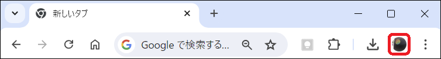
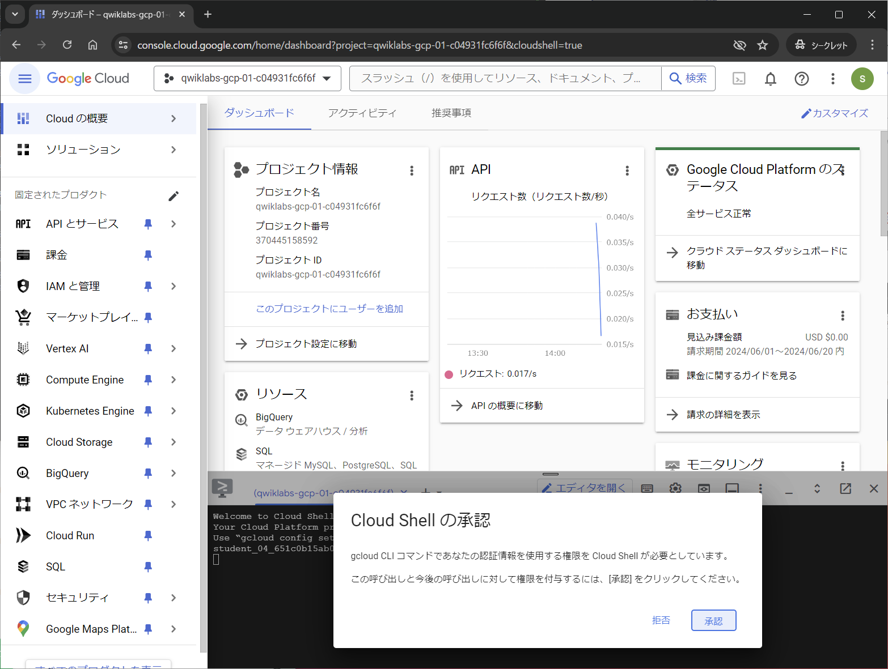

# 1. Compute Engine による VM のセットアップと REST API の構築

## 全体手順

Skills Boost の注意点
- 初回はNoCostのラボでも二回目以降はCreditが必要である
  - 回数の判定はコース単位で行われるため、同じコースの別のラボを実施すると同じコースの他のラボが初回でもCreditが必要になる
  - つまり、NoCostで実施するためには、コースを変える必要がある（今回実施するラボはどちらも別コースなので、勝手に他のラボを実施しなければNoCostで実施できる）
- ラボで必要ではないリソースや必要数以上のリソースを使用するとアカウントがブロックされる場合がある
- 制限時間があるため余裕持って終われるようにする

以下の箇条書きを補足し、項目ごとに分離してドキュメント化する。

1. [Google Cloud Skills Boost - Compute Engine を使用した Google Cloud でのウェブアプリのホスティング](https://www.cloudskillsboost.google/course_templates/638/labs/480366?locale=ja)
    1. `設定と要件` をやる
        1. `リージョンとゾーンを設定する` はやらなくて良い
2. [Compute Engine での Go のスタートガイド](https://cloud.google.com/go/getting-started/getting-started-on-compute-engine?hl=ja)
    1. `目標`を読む
    2. `料金`を読む（今回はSkillsBoostアカウントを作成して使用しているため、初回は無料で2回目以降が1クレジット）
    3. `準備`を行う
        1. `プロジェクト セレクタに移動`をクリックし、プロジェクトをクリックし、プロジェクト ID をメモしておく
            1. 例 : qwiklabs-gcp-02-84ace8ee5776
    4. `APIを有効にする` をクリックし、Compute Engine, Cloud Build API を有効化する
    5. `Cloud Shellに移動`をクリックし、環境のセットアップ（git clone）を行う
    6. `gcloud config set project YOUR_PROJECT_ID` を実行する
        1. YOUR_PROJECT_ID はメモしておいたプロジェクト ID
        2. ガイドページの環境変数設定機能を使うと便利（赤いペン）
    7. `Cloud Shell でアプリを実行する` をやる
        1. これをやることによって、VM内のローカル環境で動作確認が行える
            1. `ポート8080でプレビュー` でHelloWorld!を確認できたら成功
    8. `単一インスタンスへのデプロイ` をやる
        1. ビルドを行う前に、ファイルを修正する
            1. [golang-samples/getting-started/gce/startup-script.sh](./source/1/startup-script.sh)を編集する
                1. Logging機能が提供終了している？ためか動作しないため
            2. [golang-samples/getting-started/gce/cloudbuild.yaml](./source/1/cloudbuild.yaml)を編集する
                1. バージョン不整合によりコンパイルエラーが発生しないようにビルド環境と実行環境を合わせる
        2. ZONEは `us-central1-a` を使用する（なんでもいい）
        3. 外部 IP アドレスからHelloWorld!を確認できたら成功
    9. [golang-samples/getting-started/gce/main.go](./source/1/main.go)を編集する
        1. `/v1/customer/22530`にアクセスするとJsonが表示される→成功
            1. [Google Cloud Skills Boost - Developing a REST API with Go and Cloud Run](https://www.cloudskillsboost.google/course_templates/741/labs/464421) または [※バグあり Google Cloud Skills Boost - Go と Cloud Run を使用した REST API の開発](https://www.cloudskillsboost.google/course_templates/741/labs/463386) と同様の動作が確認できる

## Google Cloud Platform の概要


## Google Cloud Skills Boost の概要


## Google Cloud Skills Boost - Compute Engine を使用した Google Cloud でのウェブアプリのホスティング

### Chromeのインストールとログイン

1. Google Cloud Skills BoostはChromeを使用しての受講が推奨されています。
[こちら](https://www.google.com/intl/ja_ALL/chrome/)
からダウンロードし、インストールしてください。
1. Chromeを起動し、右上のアイコンをクリックします。

1. `追加`をクリックし、事前に配布しているドメインが`@gdsc.tamasan238.work`のアカウントでログインしてください。
1. [Google Cloud Skills Boost](https://www.cloudskillsboost.google/?locale=ja)
にアクセスし、右上の`ログイン`をクリックします。
1. 続いて`Google アカウントでログイン`をクリックすると、Google Cloud Skills Boostにログインすることができました。
### Google Cloudにアクセスする
Google Cloud Skills Boostの受講にあたって、以下の注意事項を確認してください。

- ラボを受講するにはCreditが必要です。初回はNo Costのラボでも2回目以降にCreditが必要になることがあります。
- ラボには制限時間が設けられています。制限時間内に終了できるようにしましょう。

それでは、ラボを開始しましょう。

1. [Compute Engine を使用した Google Cloud でのウェブアプリのホスティング](https://www.cloudskillsboost.google/course_templates/638/labs/480366?locale=ja)
にアクセスします。

> [!CAUTION]
> No Costと表示されていることを確認してください。
> 

2. `ラボを開始`をクリックします。

    ラボを開始すると、ラボの終了まで使用できる一時的なGoogleアカウントが発行されます。

    

3. `Open Google Cloud console`を**右クリック**し、`シークレット ウィンドウで開く`を選択します。
    1. ログイン画面が表示されたら、**先ほど発行された**Usernameをコピー&ペーストして`次へ`をクリックします。
    1. 同様にPasswordをコピー&ペーストして`次へ`をクリックします。

4. 確認画面が表示されます。内容を確認して`理解しました`をクリックします。
    

5. 同意画面が表示されます。内容を確認して1つ目のチェックボックスにチェックをつけて`AGREE AND CONTINUE`をクリックします。
    

6. Google Cloud コンソールのダッシュボードにアクセスすることができました。

> [!ATTENTION]
> 言語は右上の三点メニューの`Perferences`または`設定`から変更することができます。
> 

### Cloud Shell をアクティブにする
Cloud Shellは、開発ツールと一緒に読み込まれるGoogle Cloudで稼働する仮想マシンです。Cloud Shellを使用すると、コマンドラインでGoogle Cloudリソースにアクセスできます。

1. コンソール画面上部にある`Cloud Shell をアクティブにする`アイコンをクリックします。
2. 画面下部にCloud Shellが現れ、ポップアップが表示されるので`承認`をクリックします。
    
    接続が完了した時点で、プロジェクトに各自の`PROJECT_ID`が設定されます。黄色の文字で出力されているのが`PROJECT_ID`です。
    
    `PROJECT_ID`は後ほど使用しますので、メモ帳などに保存しておいてください。

### Cloud Shellを使用してみる
次のコマンドを使用すると、有効なアカウント名を一覧で表示します。
```sh
gcloud auth list
```

次のコマンドを使用すると、プロジェクトIDを一覧で表示します。
```sh
gcloud config list project
```
`gcloud`はGoogle Cloudのコマンドラインツールです。このツールはCloud Shellにプリインストールされています。

## Compute Engine での Go のスタートガイド

### 目標
- Cloud Shellを使用してHello Worldサンプルアプリをダウンロードしてデプロイする。
- Cloud Buildを使用してHello Worldサンプルアプリをビルドする。
- Hello Worldサンプルアプリを単一のCompute Engineインスタンスにデプロイする。
- 

### 料金

### 準備
1. Compute Engine APIとCloud Build APIを有効にします。

    1. [こちら](https://console.cloud.google.com/flows/enableapi?apiid=compute%2Ccloudbuild.googleapis.com&hl=ja&_ga=2.43494823.320691267.1718768559-758716497.1715673126)
    のリンクを**右クリック**し、シークレットウィンドウで開きます。
    1. プロジェクト名が先ほどメモした`PROJECT_ID`と同じであることを確認して`次へ`をクリックします。
    1. `有効にする`をクリックします。
2. 環境のセットアップ（git clone）を行います。Cloud Shellでは直接クラウドリソースにアクセスすることができます。
    1. [こちら](https://cloud.google.com/console/cloudshell/open?git_repo=https%3A%2F%2Fgithub.com%2FGoogleCloudPlatform%2Fgolang-samples&working_dir=getting-started%2Fgce&hl=ja)
    のリンクを**右クリック**し、シークレットウィンドウで開きます。
    1. `確認`をクリックします。

1. Cloud Shellで新しいGoogle Cloudプロジェクトを設定します。
    ```sh
    gcloud config list project PROJECT_ID
    ```
    > [!ATTENTION]
    > 

## DBの導入やスケーラビリティの実現について

Google Cloud Compute Engine によって、VM のセットアップと REST API の構築が完了しました。

しかし、現状のmain.goはコード内に直接データを記述しているため、アルゴリズムとデータが密結合している状態です。また、データベースを導入していないため、データの永続化やアクセスの管理が難しい状況です。

これを解決するためには、データベースを導入し、データとアルゴリズムを分離することが重要です。

また、スケーラビリティの観点からも、現状の Compute Engine では、負荷が増加した際にスケールアウトが難しいという課題があります。

これらの課題を解決するために、次のステップとして、Cloud Run と Firestore によるサーバーレス REST API の構築を行いましょう。

[2. Cloud Run と Firestore によるサーバーレスREST APIの構築](2-sv-less.md)へ進む

[目次に戻る](README.md)
